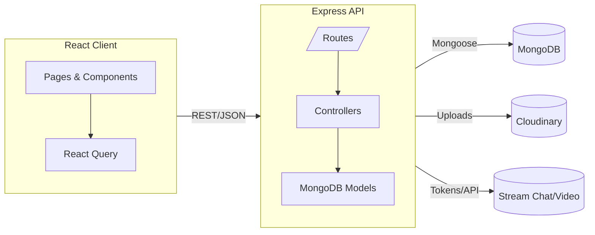

# ✨ Shall WeTalk ✨

Shall WeTalk is a modern language exchange platform where users can teach others their native language, while also learning new languages from native speakers around the world. Connect, chat, and practice in real time — everyone is both a teacher and a learner!


## 🚀 Features

- 📝 User Signup, Login, and Onboarding
- 👤 User Profile Page Management (view, edit, update your details)
- 🤝 Send and Accept Friend Requests
- 🔔 Notification Alerts for New Friend Requests
- 🔋 Pagination for Recommended Language Partners
- 🌐 Real-time Messaging: Reply, Delete, Start Thread, Add Emoji, Send Image, Typing Indicators & Reactions
- 🤖 AI Smart Reply Suggestions in chat (optional, Groq API)
- 💡 AI Icebreakers & Topic Starters (optional) — “Need a topic?” chip above input
- 📹 1-on-1 and Group Video Calls: Share Screen, Add Emoji Reaction, Record Meeting (Stream integration)
- 🔐 JWT Authentication & Protected Routes
- 🌍 Language Exchange Platform with Modern UI
- ⚡ Tech Stack: React + Express + MongoDB + TailwindCSS + DaisyUI + TanStack Query + Cloudinary + Multer + Axios
- 🧠 Global State Management with React Query
- 🚨 Robust Error Handling (Frontend & Backend)
- 🎯 Scalable, Modular Project Structure
- ⏳ Server-side Search for Users & Friends
- 🧪 Frontend testing with Vitest + Testing Library
- 🧪 Backend testing with Vitest + Supertest + mongodb-memory-server
- 🤖 GitHub Actions CI workflow (runs client and server tests on push/PR)
- 🐳 Docker Compose for local development (MongoDB + API + Vite client)
- 🧭 Architecture ADR with diagram (`docs/adr/0001-architecture.md`)

## 🧭 Architecture Overview



---

## 🗂️ Project Structure

```
shall-we-talk/
├── client/                         # Frontend (React + Vite + Tailwind CSS + DaisyUI + React Query + Axios)
│   ├── src/
│   │   ├── assets/                 # Images and static assets
│   │   ├── components/             # Reusable React components
│   │   │   └── __tests__/          # Component unit tests
│   │   ├── config/                 # API and utility functions
│   │   │   └── __tests__/          # Config/utils tests
│   │   ├── constants/              # App-wide constants
│   │   ├── hooks/                  # Custom React hooks
│   │   ├── pages/                  # Page-level React components
│   │   │   └── __tests__/          # Page integration tests
│   │   ├── App.jsx
│   │   ├── main.jsx
│   │   └── index.css
│   ├── eslint.config.js            # ESLint config (includes Vitest globals for test files)
│   ├── setupTests.js               # Vitest setup (jest-dom matchers)
│   ├── vite.config.js              # Vite + Vitest test config (jsdom environment)
│   ├── index.html                  # Main HTML file
│   └── package.json                # Frontend dependencies & test scripts
├── server/                         # Backend (Node.js + Express + MongoDB, MVC pattern)
│   ├── src/
│   │   ├── config/                 # DB, cloudinary, multer, etc.
│   │   ├── controllers/            # Controllers (business logic, part of MVC)
│   │   ├── middleware/             # Express middleware (auth, error handling, etc.)
│   │   ├── models/                 # Mongoose models (data layer, part of MVC)
│   │   ├── routes/                 # Route definitions (Express routers, part of MVC)
│   │   └── server.js               # Entry point
│   └── package.json                # Backend dependencies
├── package.json                    # Root metadata
└── README.md                       # Project documentation
```

---

## 🤖 AI Smart Reply Suggestions

Smart, context-aware reply suggestions inside chat.

- What it does: Generates 3 short replies from the last messages in the thread. Click a chip to send immediately to the conversation.
- Where it shows: Chat screen, a top bar with a “Reply like this...” button and suggestion chips.
- Fallbacks: If the AI API isn’t configured or is rate-limited, generic safe suggestions are returned.

Setup

- Create a free Groq account and API key: https://console.groq.com/keys
- Add the key to the backend env file `server/.env`:

```
GROQ_API_KEY=gsk_xxx
# Optional: choose models, first available will be used
GROQ_MODELS=llama-3.1-8b-instant,llama-3.1-70b-versatile
```

- Do NOT put this key in `client/.env`. Restart the server after updating env.

Usage

- Open a chat → click “Reply like this...” → pick a chip → it appears in the chat immediately.

API Reference

- Method: POST `/api/chat/suggest-replies` (auth required)
- Body:

```
{
  "messages": [
    { "role": "me", "content": "Hi!" },
    { "role": "friend", "content": "How are you?" }
  ]
}
```

- Response:

```
{ "suggestions": ["I'm good, thanks!", "Doing well—how about you?", "Pretty good! What's new?"] }
```

## 💡 AI Icebreakers & Topic Starters

Suggests 5 friendly topics tailored to both users’ languages, locations, and bios.

- What it does: Generates short, beginner-friendly one-line prompts. Click to send.
- Where it shows: Chat screen, a “Need a topic?” chip row above the input.
- Fallbacks: If AI isn’t configured, generic safe topics are returned.

Usage

- Open a chat → click “Need a topic?” → pick a chip → it sends immediately.

API Reference

- Method: POST `/api/chat/icebreakers` (auth required)
- Body:

```
{ "partnerUserId": "<other-user-id>" }
```

- Response:

```
{ "topics": ["What's a favorite place to visit in your city?", "What music are you listening to lately?", "..."] }
```

Notes

- Uses the same `GROQ_API_KEY` backend env as Smart Replies.
- Free-tier limits apply.

---

## 🧪 .env Setup

### Backend (`server/.env`)

```
PORT=5001
MONGODB_URI=your_mongodb_uri
JWT_SECRET=your_jwt_secret
CLOUDINARY_CLOUD_NAME=your_cloud_name
CLOUDINARY_API_KEY=your_api_key
CLOUDINARY_API_SECRET=your_api_secret
NODE_ENV=development
GROQ_API_KEY=gsk_xxx # optional, enables AI suggestions
# GROQ_MODELS=llama-3.1-8b-instant,llama-3.1-70b-versatile
```

### Frontend (`client/.env`)

```
VITE_STREAM_API_KEY=your_stream_api_key
```

---

## 🔧 Run the Backend

```bash
cd server
npm install
npm run dev
```

---

## 💻 Run the Frontend

```bash
cd client
npm install
npm run dev
```

The frontend will be available at `http://localhost:5173` (or as specified by Vite).

---

## ✅ Frontend Testing

- Stack: Vitest, @testing-library/react, @testing-library/jest-dom, jsdom
- Config: test environment set to jsdom in `client/vite.config.js`, global matchers loaded via `client/setupTests.js`
- Test locations:
  - `client/src/components/__tests__/*`
  - `client/src/pages/__tests__/*`
  - `client/src/config/__tests__/*`
- Commands (run from `client/`):
  - `npm run test` — run the suite once
  - `npm run test:watch` — watch mode
  - `npm run test:coverage` — coverage report

---

## ✅ Backend Testing

- Stack: Vitest, Supertest, mongodb-memory-server
- App structure: `server/src/app.js` exports the Express app; `server/src/server.js` starts it (skips start in `NODE_ENV=test`)
- Config: `server/vite.config.js` (node env) + `server/src/test/setup.js` (in-memory Mongo, DB cleanup between tests)
- Test locations:
- `server/src/routes/__tests__/*.test.js`
- Commands:
  - From `server/`: `npm run test` (watch: `npm run test:watch`, coverage: `npm run test:coverage`)
  - From repo root: `npm test` (runs client then server)
- External services are mocked in tests (e.g., Stream token, Cloudinary upload) to keep tests fast and deterministic

---

## 🐳 Run with Docker Compose (local dev)

This repo includes a `docker-compose.yml` to run MongoDB, the Express API, and the Vite client together.

Prerequisites:

- Docker Desktop 4.0+

Steps:

1. Copy environment file for the server and fill in values as needed:
   - `cp server/.env.example server/.env`
2. Start the stack:
   - `docker compose up --build`
3. Open the apps:
   - Client: http://localhost:5173
   - API: http://localhost:5001 (health: `/`), API base: http://localhost:5001/api

Notes:

- Hot reload is enabled for both client and server via bind mounts.
- Server connects to Mongo at `mongodb://mongo:27017/shallwetalk`.
- In production, the server serves the built client from `client/dist` when `NODE_ENV=production`.

---

## 📄 License

MIT
