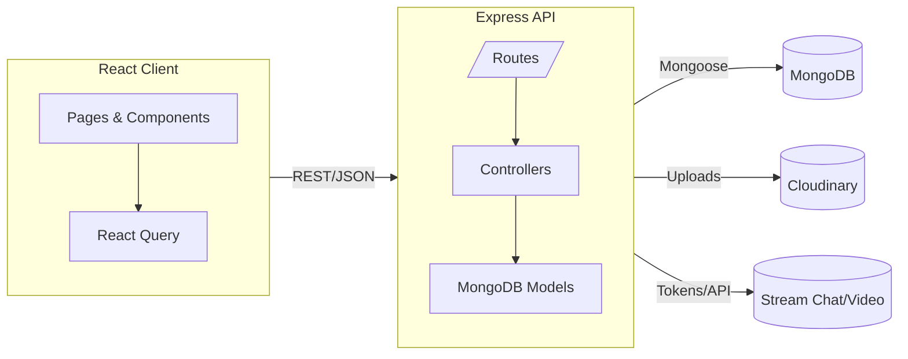

# ADR 0001: Architecture Overview

Date: 2025-08-10

Status: Accepted

## Context

Shall WeTalk is a full‑stack web app with a React client, an Express API, and MongoDB. It supports authentication, social graph (friends, requests), chat features, and video calls through Stream.

## Decision

Adopt a modular monorepo with separate client and server packages:

- Client: React + Vite, React Router, React Query, Tailwind + DaisyUI
- Server: Node.js + Express, JWT auth, Mongoose, Cloudinary/Multer
- Realtime/video: Stream
- Tests: Vitest (client & server), Supertest, mongodb-memory-server
- Local dev orchestration: Docker Compose (client + server + Mongo)

## Rationale

- Clear separation of concerns while keeping a single repo for DX
- Fast dev/build via Vite and hot reload
- MongoDB fits document‑oriented user and message data
- Stream reduces complexity of realtime/video features
- Compose provides reproducible local setup without manual installs

## Consequences

- Vendor lock‑in for realtime features (Stream)
- Need to manage environment variables across packages
- CI needs to install and test both packages

## Alternatives Considered

- Single server serving SSR (Next.js): rejected to keep client and API independent
- WebSockets in‑house (Socket.IO): replaced by Stream to accelerate delivery

## Diagram

